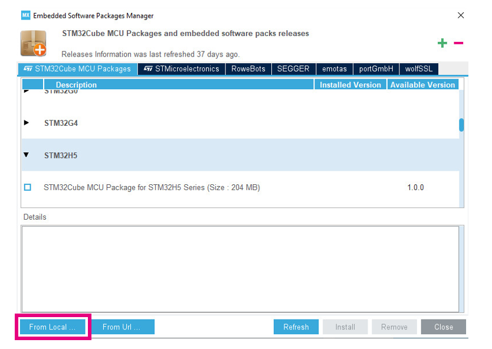

----!
Presentation
----!

# Introduction
## Dear Participant of STM32WBA Workshop,
<br>

<ainfo>
You are supposed to move the following section "Before STM32WBA session" once you completed this chapter
</ainfo>

----

Welcome to our comprehensive guide on how to prepare for the live version of the STM32H5 Workshop session. This step-by-step guide is designed to provide you with all the necessary information about the prerequisites, installation process, and links to materials that will be useful during the session.

In this guide, you will find detailed information about the required software and hardware, as well as a brief overview of the installation process. Additionally, we have included links to materials that will be helpful during the session.

In the appendix, you will find some basic information about the board that we will be using during the session, as well as useful information about the configuration and usage of the STM32CubeIDE.
<br>

To navigate through this guide, please use the navigation buttons provided.
<br>

  

<br>

If you have any questions or encounter any problems, please do not hesitate to contact us at  **[manuel.marcias@st.com](manuel.marcias@st.com)**

We look forward to seeing you at the STM32H5 Workshop live session!
<br>

## Yours,
## STMicroelectronics 
<br>

# Prerequisites
- Hardware:
  - **PC with MS Windows 10 operating system and admin rights granted**
  - **1 type-c/type-A USB** cable 
  <br>
  
  <br>
  - **[NUCLEO-STM32H563ZI](https://www.st.com/en/evaluation-tools/nucleo-h563zi.html)** Nucleo-144 development board. It will be provided to you by ST during the handson
  <br>
  
  <br>
- Software (PC with **MS Windows 10** operating system):
  - **[STM32CubeMX](https://www.st.com/en/development-tools/stm32cubemx.html)** in version 6.9.1
  - **[STM32CubeIDE](https://www.st.com/en/development-tools/stm32cubeide.html)** in version 1.13.1
  - **[STM32H5 Cube library](https://www.st.com/en/embedded-software/stm32cubeh5.html)** in version 1.1.1
  - **[Virtual COM port drivers](https://www.st.com/en/development-tools/stsw-stm32102.html)**
  -  any **serial terminal** application (e.g. **[Termite](https://termite.software.informer.com/3.4/)**)
<br>

# Installation process
- download **STM32CubeMX** from [here](https://www.st.com/en/development-tools/stm32cubemx.html)
- install **STM32CubeMX** (if not yet done)
- download **STM32CubeIDE** from [here](https://www.st.com/en/development-tools/stm32cubeide.html)
- Install **STM32CubeIDE** (if not yet done)
- download and install **STM32H5 Cube library** (if not done yet):
  - run **STM32CubeMX**
  - go to `Help -> Manage Embedded Software Packages`
  - within package manager window find `STM32H5`, unroll it and select newest available version ( in your case STM32H5 1.1.0)
  - press `install now`
<br>

<br>
- In case of library installation problems please try an alternative way:
  - download **STM32H5 Cube library** (.zip file)
  - run **STM32CubeMX**
  - go to `Help -> Manage Embedded Software Packages`
  - within package manager window use option `From local` 
<br>  

<br>

<ainfo>
STM32CubeMX and STM32CubeIDE are using the same repository by default, so the installed STM32H5 Cube library will be visible in both tools.
</ainfo>


<br>
----


# Verification process before the workshop
The purpose of this part is checking whether all software components are installed properly.
<br>
Additionally prepared test project can be a base for next hands-on parts during the workshop.

## **STM32CubeIDE and STM32H5 Cube library**
<br>

----

<br>
**Task definition**
<br>

- Using STM32CubeIDE
  - Enable SWD for debug
  - Disable TrustZone
  - Configure ICACHE (in any of available modes)
- Select and configure USART3
  - in asynchronous mode,
  - using default settings (115200bps, 8D, 1stop bit, no parity) 
  - on PA9/PA10 pins
<br>

----

<br>
## **Step1** - project creation and peripherals configuration
 - Run **STM32CubeIDE**
 - Specify workspace location (i.e. `C:\_Work\H5_GPDMA`)
<br>

<br>
- Start new project using one of the below methods:
  - by selecting `File->New->STM32Project` 
  - by click on `Start new STM32 project` button
  <br>
  
<br>
- switch to **Board Selector** tab
- select NUCLEO-**H563**ZI board
- press `Next` button
- within STM32 Project window:
  - specify project name (i.e. `H5_UART`)
  - keep **enable TrustZone** option unchecked
  - press `Finish` button
  - on question pop-up window "Initialize all peripherals with their default state?" press `No` button 
  - on question pop-up window "Switch to proper CubeIDE perspective?", if it is showed, press `Yes` button 
  - on worning pop-up window "Do you still want a code generation?", press `No` button 
  - on following information pop-up window, it was our decision did not generate code, press `OK` button 
  <br>
   
<br>
- Peripherals configuration: Pinout&Configuration tab
- **ICACHE configuration** (System Core group)
  - select either 1-way or 2-ways (we will not focus on performance within this workshop)
  <br>
  
  <br>
- **USART3 configuration** (Connectivity group)
  - select Asynchronous mode
  - keep default settings in configuration:
    - Basic parameters: 115200bps, 8bits data, 1 stop bit, no parity
    - Pins assignment: PD8, PD9
    - no interrupts, no DMA usage
  <br>
    
<br>
- **SWD configuration** (Trace and debug group)
  - select Serial wire debug
  - this is usually not necessary, because of default state of SWD pins, but it is good habit to do it
  <br>
    
<br>
- **Project settings**
  - select `Project Manager` tab
  - check project location (.ioc file)
  - check project name
<br>
   
<br>
  - generate project by one of the ways:
    - by pressing "gear" icon
    - by select `Project->Generate Code`
    - by pressing **Alt+K**
<br>
  
<br>

----

<br>
## **Step2** - coding part (`main.c` file)
<br>
Define the buffer of bytes to be sent over **USART3** (`USER CODE PV` section):
<br>

```c
  uint8_t buffer[]={"Hello STM32H5\r\n"};
```

<br>

<br>
Turn on **LED1_GREEN** (`USER CODE 2` section):
<br>

```c
  HAL_GPIO_WritePin(LED1_GREEN_GPIO_Port, LED1_GREEN_Pin, 1);
```

<br>

<br>
Toggle **LED1_GREEN** (`USER CODE 3` section)
<br>
Toggle **LED2_YELLOW** 
<br>
Start transmit of the data over **USART3** using prepared buffer and ***polling*** method
<br>
Wait for 250 ms
<br>

```c
  HAL_GPIO_TogglePin(LED1_GREEN_GPIO_Port, LED1_GREEN_Pin);
  HAL_GPIO_TogglePin(LED2_YELLOW_GPIO_Port, LED2_YELLOW_Pin);
  HAL_UART_Transmit(&huart3, buffer, 15, 200);
  HAL_Delay(250);
```

<br>

<br>

----

<br>
## **Step 3** - build the project
- Build the project using `hammer` button or `Project->Built All` or **Ctrl+B**
<br>

<br>

<ainfo>
In case of neither errors nor warnings after this process, STM32CubeIDE and STM32H5 library are installed correctly. Last point - debug session will be verified during first hands on part on the workshop.
</ainfo>


<ainfo>
## **Congratulations** You have completed installation part. Now you are fully prepared for the live workshop session. 
</ainfo>

----

# Materials for the session
- Access to tools dedicated web pages:
  - [STM32CubeIDE](https://www.st.com/en/development-tools/stm32cubeide.html)
  - [STM32CubeMX](https://www.st.com/en/development-tools/stm32cubemx.html)
  - [STM32H5 Cube library](https://www.st.com/en/embedded-software/stm32cubeh5.html)
- [STM32 on-line training resources](https://www.st.com/content/st_com/en/support/learning/stm32-education/stm32-moocs.html)
- documentation
  - [STM32H563 datasheet](https://www.st.com/resource/en/datasheet/stm32h563zi.pdf)
  - [STM32H563 reference manual](https://www.st.com/resource/en/reference_manual/rm0456-stm32u575585-armbased-32bit-mcus-stmicroelectronics.pdf)
  - [NUCLEO-H563ZI-Q board schematics](https://www.st.com/resource/en/schematic_pack/mb1549-u575ziq-c03_schematic.pdf)


----


<ainfo>
Please now move to "Before STM32WBA session" to finalize the prerequisites for the whole workshop
</ainfo>
